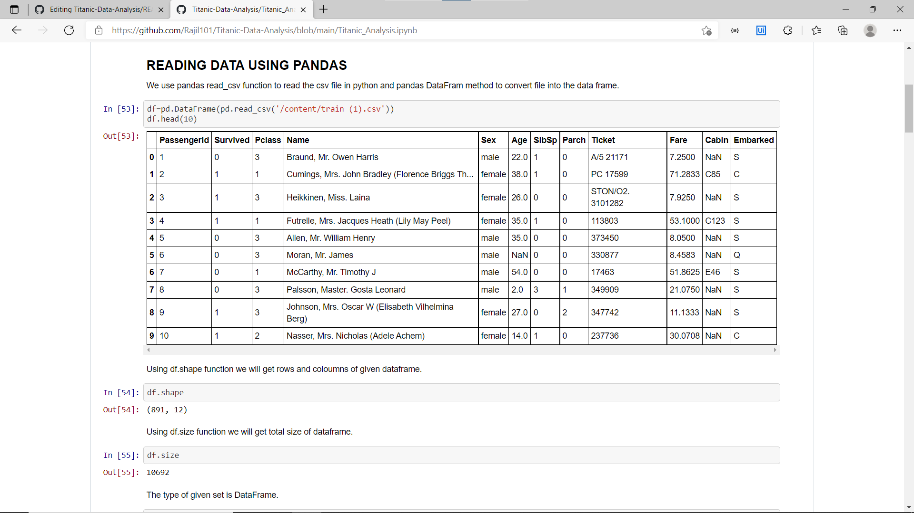
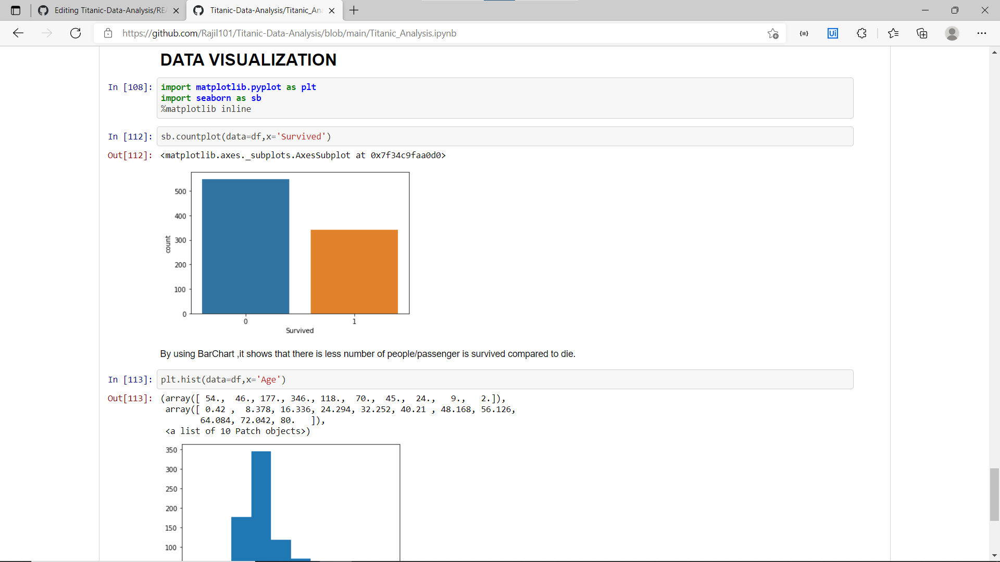

# The Great-Titanic-Analysis

In these analysis, I worked on titanic ship dataset find insights with various attribuites.

•Used numpy , Pandas library, 

•handled null values,

•Used matplotlib, seaborn for visualisation.

*****************************

**CONCLUSION**

•Female passengers were prioritized over men.

•People with high class or rich people have higher survival rate than other.The hierachichy might have been followed while saving the passengers.

•Passengers travelling with their family have higher survival rate.

•Passenger who boarded the ship at Cherbourg,srvived more in proportion then the others.

•By the help of Analytical Visualisation we can predict with more precision and easy to understand.
